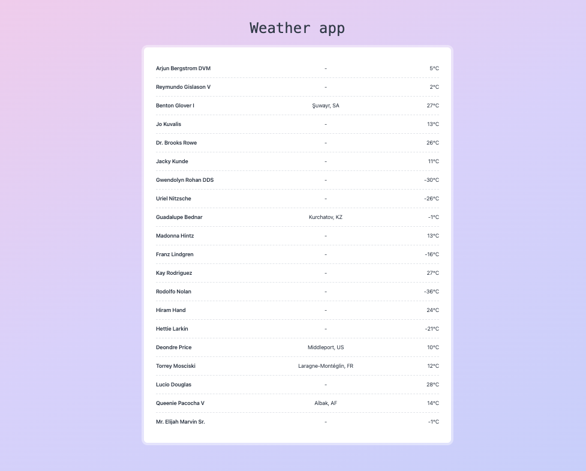
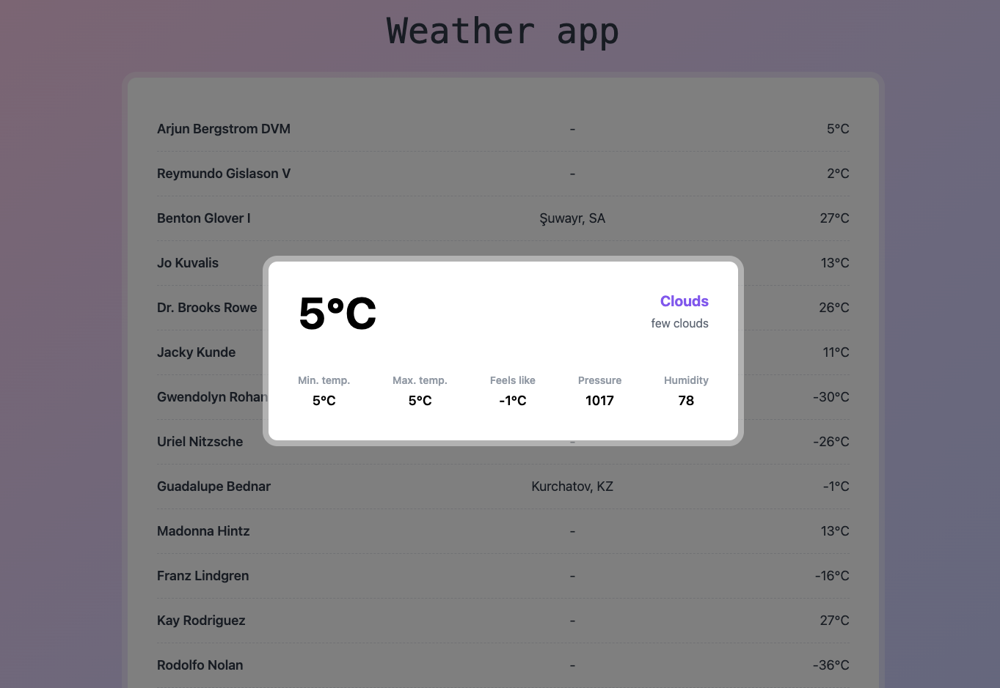

# Fullstack Challenge (Weather app)
A simple app to show weather for a set of users.

### Demo

#### List of users

#### Single user details

### Tools & Tech stack used
- Laravel (back-end api)
- VueJS (front-end)
- TailwindCSS (UI)
- Pusher (WebSocket)
- Redis (Cache)
- MySQL (Database)
- [OpenWeather API](https://openweathermap.org/api)
- [GrumPHP](https://github.com/phpro/grumphp) (Code quality)

## System design
- To provide a better UX, we're caching relevant user data instead of calling the Weather API on every page load. 
- To make sure that we're providing updated data to the users, we're doing the following:
  - Running a scheduled command every 30 minutes (frequency can be changed from config) to update each users weather data by calling the weather api and caching the result.
  - Every time a new user is created we'll run an async job to fetch weather data for this user from the weather api.
- We're also providing real time update via websocket so that the user will see the updated result in the page if the users data is updated via the scheduled job, or any new user is created.

## Project installation instruction
### API
- Clone the repository
- Navigate to `/api` folder
- Ensure docker is installed and active on host
- Copy .env.example: `cp .env.example .env` (relevant API keys are added in the `.env.example` for easier testing purpose)
- Start docker containers `docker compose up` (add `-d` to run detached)
- Connect to container to run commands: `docker exec -it fullstack-challenge-app-1 bash`
  - Make sure you are in the `/var/www/html` path
  - Install php dependencies: `composer install`
  - Setup app key: `php artisan key:generate`
  - Migrate database: `php artisan migrate --seed`
  - Run queue listener: `php artisan queue:listen`
  - Run tests: `php artisan test`
  - If you want to run the scheduler: `php artisan schedule:work`

### Frontend
- Navigate to `/frontend` folder
- Ensure nodejs v18 is active on host
- Install javascript dependencies: `npm install`
- Run frontend: `npm run dev`
- Visit frontend: `http://localhost:5173`

### Testing the real time update
A test command is added to create dummy user data to verify that real time update is working. 
To test it:
- Open the page in browser: `http://localhost:5173`
- From terminal, connect to container to run commands: `docker exec -it fullstack-challenge-app-1 bash`
  - Run: `php artisan create-new-user` (make sure that the queue worker is running)
- See that the newly created user's data is available in the browser (this might take a few seconds depending on the queue processing and data fetching from the weather api)

### Production deployment
Some of the things are intentionally skipped as it is only for coding test. 
But we'll consider the following if this app needs to be deployed in production:
- Use `Laravel horizon` to manage and monitor async jobs.
- Setting up the cron scheduler.
- In the front-end, the API URL and app keys are hard-coded for now. But it needs to be read from the `environment variables`.

### Note
A few things were considered while implementing the solution:
- Followed loose coupling for the Weather API service (`OpenWeatherApiService`) class using an interface (`WeatherApiInterface`) and bound the implementation in service container so that it's easier to switch to other API service implementation if needed.
- Used `exponential backoff strategy` for third-party API calling to avoid rate limiting and service unavailability issues.
- Kept a separate DB table for users weather data so that it'll be easier to store more relevant data (like `forecast` etc.) in the future. 
- The cron scheduler is running every 30 minutes just to be on the safe side not to have data older than 1 hour. This can be changed in config if needed. 
- For faster development, Eloquent ORM is used. However, the implementation can be changed to `Query builder` to get better performance.